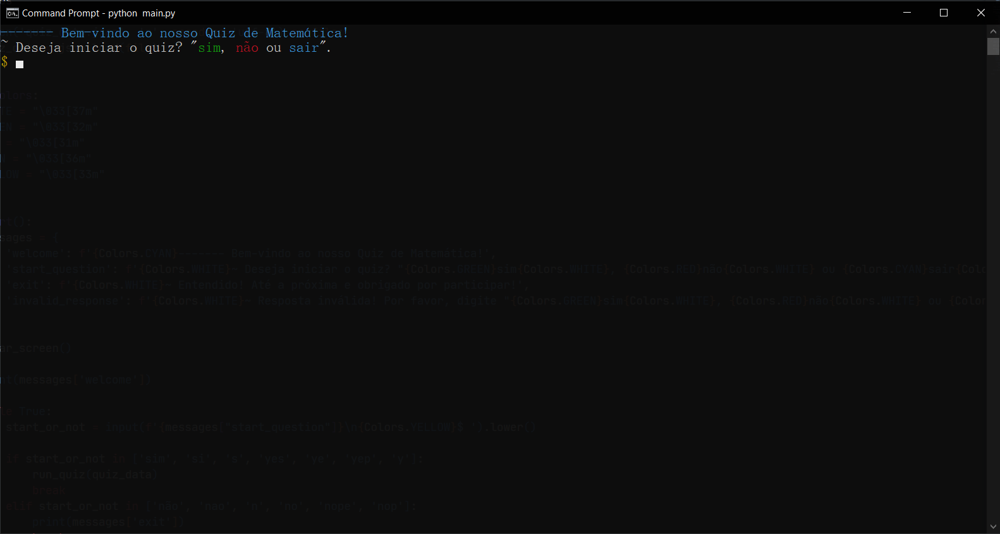

## Build With

- Python

## Installation

. *Linux and MacOS*

```bash
https://github.com/alemobn/simple-maths-quiz.git
cd simple-maths-quiz
python main.py
```

. *Windows* 


[Download](https://github.com/alemobn/simple-faq/archive/refs/heads/main.zip) > Extract > Open CMD >
```bash
python main.py
```
